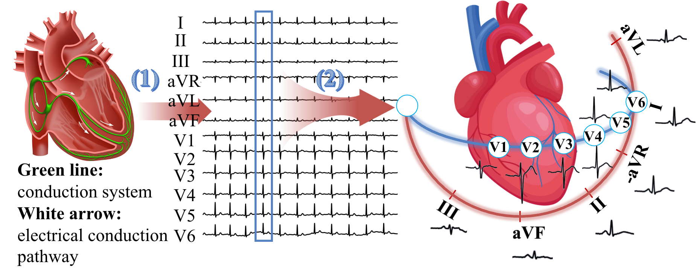

#  CLEAR-HUG 
## Tracing the Heart’s Pathways: ECG Representation Learning from a Cardiac Conduction Perspective
This repository contains the implementation of the CLEAR-HUG eSSL method.
<p align="center">
  
  
</p>

## :fire: Updates
* **[Dec 2025]** We have released the evaluation code, and the pretraining code will be made available in Jan 2026.
* **[Nov 2025]** CLEAR-HUG has been accepted to AAAI 2026!

## Setup
### Environment
Please install Torch first.
```
pip3 install --pre torch torchvision --index-url https://download.pytorch.org/whl/nightly/cu126
```
```
conda create -n clear_hug python=3.10
conda activate clear_hug
pip install -r requirements.txt
```
### Data preparation
For both pretraining and downstream tasks, all data should be preprocessed into QRS tokens, which represent heartbeats in our paper.

Our preprocessing pipeline is based largely on the repository [HeartLang](https://github.com/PKUDigitalHealth/HeartLang?tab=readme-ov-file), and we follow its overall steps and code structure where applicable. However, our QRS tokenization procedure differs from HeartLang’s implementation. Please use our QRSTokenizer.py for tokenization.

Please download [MIMIC-IV](https://physionet.org/content/mimic-iv-ecg/1.0/), [PTB-XL](https://physionet.org/content/ptb-xl/1.0.3/), [CPSC2018](http://2018.icbeb.org/Challenge.html), and [CSN(Chapman-Shaoxing-Ningbo)](https://physionet.org/content/ecg-arrhythmia/1.0.0/).

* **For pretraining:**

Step 1. Process the data into .npy files.
```
cd datasets/dataset_preprocess/MIMIC-IV/
mkdir -P datasets/ecg_datasets
python mimic_preprocess.py --dataset_path <path_to_MIMIC_data> --output_path datasets/ecg_datasets/MIMIC-IV
```
Step 2. Get QRS tokens.
```
python QRSTokenizer.py --dataset_name MIMIC-IV
```
* **For downstream tasks:**
  
Following HeartLang, the preprocessing code for each dataset is located under datasets/dataset_preprocess/. For example, to generate all subset files for PTB-XL (corresponding to different sub-tasks), run:
```
python datasets/dataset_preprocess/PTBXL/ecg_ptbxl_benchmarking/code/reproduce_results.py
```
Then, restructure the generated files into the expected directory layout:
```
python datasets/dataset_preprocess/PTBXL/move_ptbxl_files.py
```
The final folder structure should look like:
```
datasets/
└── ecg_datasets/
    └── PTBXL/
        ├── all/
            ├── train_data.npy
            └── ...
        ├── diagnostic/
        ├── form/
	├── ...
	├── superdiagnostic/
```
Then, you need to run QRSTokenizer.py to generate QRS tokens from the PTX-XL datasaet:
```
python QRSTokenizer.py --dataset_name PTBXL
```
Next, you need to manually copy and paste the label files into the corresponding folders under PTBXL_QRS.
```
cp datasets/ecg_datasets/PTBXL/form/*labels* datasets/ecg_datasets/PTBXL_QRS/form
```
 
We also provide the processed datasets (i.e., after QRS tokenization). If you have the appropriate data-use licenses, please contact us to request access to the processed data.

### Evaluation
**Please find our pretrained CLEAR model [here](https://drive.google.com/file/d/1z00F_HRYx_NWzXN8rGRyPFmgLr2ZXC4O/view?usp=sharing).**
To evaluate CLEAR on PTB-XL, run:
```
bash scripts/finetune/PTBXL/12Leads/form/base_form_linear_prob_0.01.sh 
```
To evaluate CLEAR-HUG, make sure to set:
```
--model CLEAR_HUG_finetune_base
--trainable moe
```
You can use the following script as a reference:
```
bash scripts/finetune/PTBXL/12Leads/form/base_form_linear_prob_1.0.sh 
```

The evaluation scripts for the other datasets follow the same pattern.

### Pretraining
Coming soon.


### BibTeX
If you find this research useful, please consider citing:
````BibTeX
@article{pan2025tracing,
  title={Tracing the Heart's Pathways: ECG Representation Learning from a Cardiac Conduction Perspective},
  author={Pan, Tan and Sun, Yixuan and Jiang, Chen and Gao, Qiong and Sun, Rui and Zhang, Xingmeng and Yang, Zhenqi and Han, Limei and Liang, Yixiu and Cheng, Yuan and others},
  journal={arXiv preprint arXiv:2512.24002},
  year={2025}
}
````

